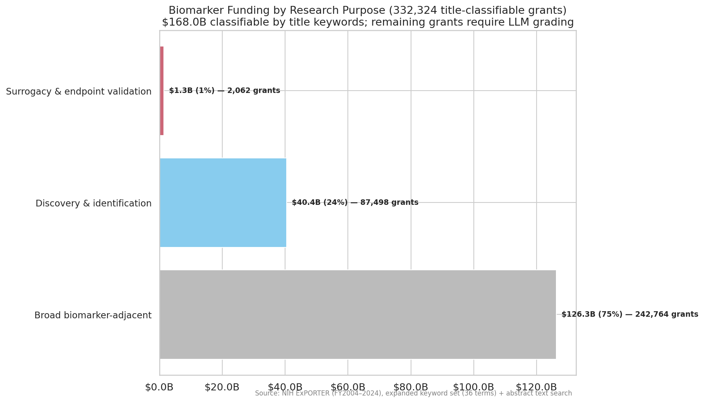
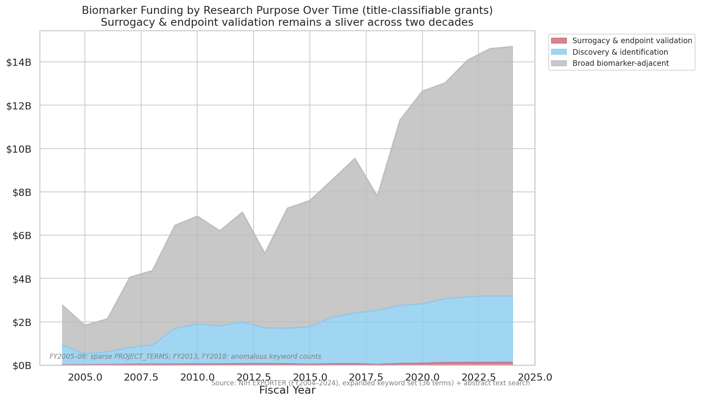
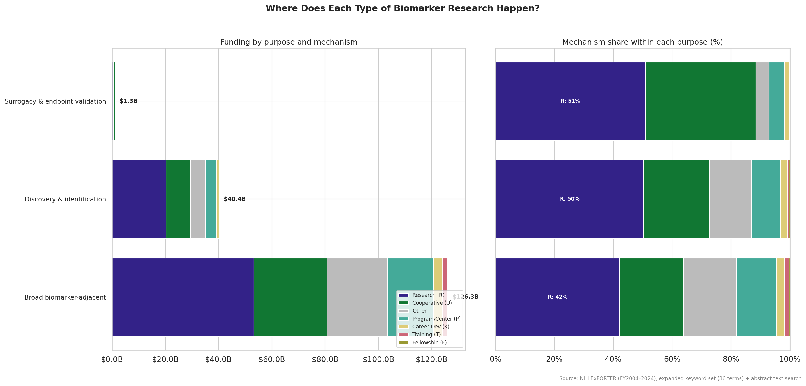

# Biomarker Screening: What Does NIH Fund?

## The Question

Does NIH biomarker funding prioritize surrogacy and endpoint validation, or is
most of it discovery work without a clear estimand? This analysis characterizes
a keyword-filtered dataset of ~332K NIH grants (FY2004-2024, dataset v3.1) by
grouping each grant's most specific keyword match into functional purpose
categories.

## Key Finding

**Surrogacy and endpoint validation is nearly absent from NIH biomarker funding.**

Of 332,324 biomarker-related grants totaling $168B over 20 years, only 2,062
(0.6%) mention surrogate endpoints or intermediate outcomes. That is $1.3B —
less than 1% of all biomarker funding.

The overwhelming majority falls into two buckets:

- **Broad biomarker-adjacent** (75%, $126B): Grants matching AND-condition terms
  like "clinical+omics" or "clinical+imaging." These grants contain both words
  somewhere in their title, keywords, or abstract, but don't use specific
  biomarker terminology. They are the broadest, least specific matches.

- **Discovery & identification** (24%, $40B): Grants that explicitly mention
  "biomarker," "genetic marker," "endophenotype," "clinical marker," or "imaging
  marker." These name biomarker concepts but don't specify how the biomarker
  relates to a clinical endpoint or decision.

Clinical decision-making terms (companion diagnostic, risk stratification,
patient selection, predicting response, response to therapy), diagnostics terms
(diagnostic accuracy/sensitivity/specificity), and precision medicine terms
(theranostics, precision oncology, disease stratification) — all defined in the
keyword set — produced **zero matches** across 20 years of NIH ExPORTER data.
These concepts either aren't used in NIH grant language or are expressed
differently than our keyword set captures.

## The Dataset (v3.1)

| Metric | Value |
|--------|-------|
| Total grants | 332,324 |
| Total funding | $168.1B |
| Core biomarker term matches | 109,234 (33%) |
| Core biomarker funding | $49.7B (30%) |
| Year range | FY2004-2024 |
| Keyword terms | 36 (13 core + 23 expanded) |
| Terms with matches | 10 of 36 |

**Matched terms (by grant count):**

| Term | Grants | Category |
|------|--------|----------|
| clinical+omics | 137,406 | Broad adjacent |
| clinical+imaging | 135,933 | Broad adjacent |
| biomarker | 105,853 | Discovery |
| genetic marker | 11,666 | Discovery |
| endophenotype | 5,344 | Discovery |
| clinical marker | 2,472 | Discovery |
| imaging marker | 1,908 | Discovery |
| surrogate endpoint | 1,485 | Surrogacy |
| intermediate outcome | 577 | Surrogacy |
| digital biomarker | 263 | Discovery |

Note: A grant may match multiple terms; PRIMARY_TERM assigns the most specific
one. 26 of 36 keyword terms produced zero matches in the ExPORTER data.

### Data quality caveats

FY2005: PROJECT_TERMS 68% populated. FY2006: PROJECT_TERMS empty. FY2013 and
FY2018: anomalous keyword counts. These years are annotated on time-series charts.

## Charts

### 1. Biomarker Spending Over Time

Total biomarker-related funding grew from ~$3B (FY2004) to ~$14B (FY2024). Core
term matches (definite biomarker work) account for roughly 30% throughout, with
the remainder captured by broader expanded terms.

### 2. Institute Allocation

NCI leads with the largest share of biomarker-related funding. The core term
concentration varies across institutes, reflecting different research cultures
around biomarker language.

### 3. Biomarker Purpose Distribution

Each grant is assigned to one purpose category based on its most specific keyword
match:

| Purpose | Grants | Funding | Share |
|---------|--------|---------|-------|
| Surrogacy & endpoint validation | 2,062 | $1.3B | 0.8% |
| Discovery & identification | 87,498 | $40.4B | 24.1% |
| Broad biomarker-adjacent | 242,764 | $126.3B | 75.2% |

Three of the six defined purpose categories (clinical decision-making,
diagnostics & prognostics, stratification & precision medicine) are empty —
those keyword terms produced zero matches in ExPORTER data.

### 4. Purpose Over Time

Discovery & identification funding grew substantially over two decades.
Surrogacy & endpoint validation remains a barely visible sliver throughout,
with no catch-up trend.

### 5. Purpose by Grant Mechanism

The left panel shows absolute funding; the right panel shows mechanism share
within each purpose. Research grants (R01, R21, etc.) are 51% of surrogacy
funding, 50% of discovery, and 42% of broad adjacent. There is no concentrated
mechanism for validation work — it is distributed the same way as everything
else, just at a tiny scale.

## What This Cannot Tell Us

This analysis classifies grants by **keyword match**, not by what the grant
actually proposes to do. A grant that matches "biomarker" might be doing rigorous
surrogate validation; a grant matching "clinical+omics" might be pure discovery.
Only LLM grading of abstracts (Phase 2) can make that distinction.

The keyword analysis does establish:

1. **The language of surrogacy is rare.** Across 332K grants, only 2,062 use
   "surrogate endpoint" or "intermediate outcome" — the terms that explicitly
   name the concept of validating a biomarker as a stand-in for a clinical
   endpoint.

2. **Most biomarker funding is terminologically vague.** 75% of grants match
   only broad AND-condition terms (clinical+omics, clinical+imaging), meaning
   they don't use specific biomarker language at all.

3. **26 of 36 keyword terms match nothing.** Clinical decision-making terms,
   diagnostics terms, and precision medicine terms are absent from NIH grant
   language as captured by ExPORTER. This suggests either a vocabulary mismatch
   between our keyword set and NIH grant conventions, or a genuine absence of
   these concepts in funded research.
