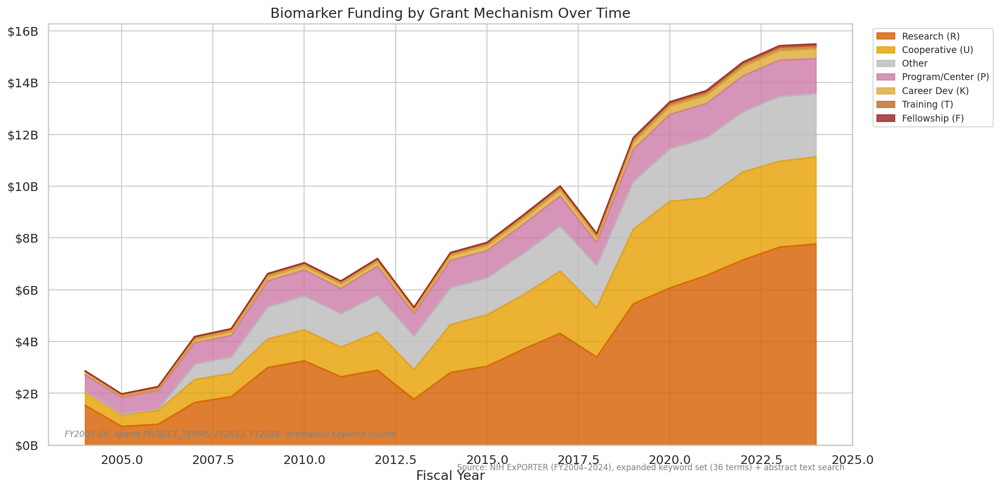
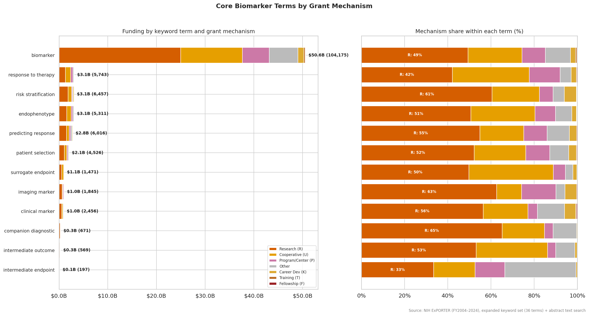
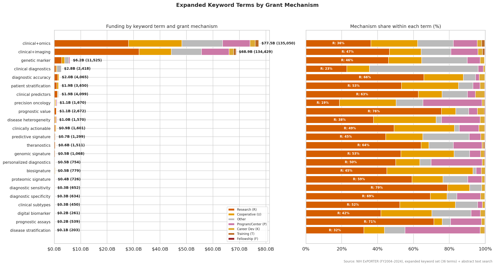

# NIH Biomarker Funding: Preliminary Keyword Analysis

## Purpose

This document characterizes 20 years of NIH-funded research that mentions
biomarker concepts, based on keyword screening of grant records from 2004 to
2024. It is a preliminary descriptive analysis — Phase 1 of a two-phase
pipeline. Phase 2 will use large language models to read each grant's abstract
and classify what kind of biomarker work was actually proposed, using a
structured rubric (`data/RUBRIC.md`) that evaluates intended biomarker use,
research design, and evidence strength for biomarker validity.

The keyword analysis here cannot tell us whether a grant that mentions
"biomarker" is doing rigorous surrogate endpoint validation or just using the
word in passing. That distinction is the purpose of Phase 2. What Phase 1 can
do is establish the overall scale of NIH biomarker funding, identify which
institutes and grant mechanisms are involved, and show how frequently specific
biomarker concepts appear across the funding landscape.

## Dataset

The dataset was constructed by searching all NIH grant records in the ExPORTER
database (fiscal years 2004–2024) for 36 biomarker-related keyword terms. Grants
were matched if any term appeared in the project title, structured keyword fields
(PROJECT_TERMS), or abstract text. Infrastructure sub-projects (administrative
cores, shared resources) were excluded by title pattern, but center grants
themselves (P30, P50) were preserved.

| Metric | Value |
|--------|-------|
| Dataset version | v3.1 |
| Total grants | 344,550 |
| Total funding | $175.2 billion |
| Year range | Fiscal years 2004–2024 |
| Keyword terms searched | 36 (13 core, 23 expanded) |
| Terms with at least one match | 35 of 36 |
| Grants matched via title or keyword fields | 276,161 (80%) |
| Grants matched via abstract text only | 68,389 (20%) |

The 13 **core terms** unambiguously indicate biomarker research: *biomarker*,
*clinical marker*, *surrogate endpoint*, *imaging marker*, *endophenotype*,
*intermediate outcome*, *intermediate endpoint*, *digital endpoint*,
*risk stratification*, *patient selection*, *companion diagnostic*,
*predicting response*, and *response to therapy*. The 23 **expanded terms** cast
a wider net, capturing grants that mention biomarker-adjacent concepts like
*diagnostic accuracy*, *precision oncology*, *genomic signature*, or
co-occurrence of "clinical" with "omics" or "imaging" terminology.

Grants matching any core term are flagged as definite biomarker research
(37% of grants, $61.8B). The remaining 63% matched only on expanded terms
or abstract text and may include false positives — grants that mention
biomarker concepts without actually studying biomarkers.

## Chart Registry

| ID | Title | Description | File |
|----|-------|-------------|------|
| C1 | Biomarker funding over time | Total funding per fiscal year, core vs. expanded term matches | `spending_over_time.png` |
| C2 | Funding by NIH institute | Top 12 pilot institutes, core vs. expanded split | `institute_allocation.png` |
| C3 | Institute funding over time | How the top 12 institutes' biomarker funding changed year by year | `institute_over_time.png` |
| C4 | Grant mechanisms over time | How funding across grant types (R01, cooperative, center, etc.) changed over time | `mechanism_over_time.png` |
| C5 | Core keyword terms by grant mechanism | Each of the 13 core biomarker terms broken down by grant type | `core_terms_by_mechanism.png` |
| C6 | Expanded keyword terms by grant mechanism | Expanded terms broken down by grant type, dominated by broad co-occurrence terms | `expanded_terms_by_mechanism.png` |

## Results

### C1: Biomarker Funding Over Time

Total NIH biomarker-related funding grew from approximately $3 billion in
FY2004 to $15 billion in FY2024. Core term matches (definite biomarker
research, shown in blue) consistently account for about one-third of the total,
with the remainder (sky blue) captured by broader expanded terms and abstract-text
matches. The growth is roughly proportional — core and expanded funding grew at
similar rates over the two decades.

### C2: Funding by NIH Institute

| Institute | Total funding | Grants | Core term rate |
|-----------|--------------|--------|----------------|
| NCI (Cancer) | $38.8B | 84,177 | 42% |
| NHLBI (Heart/Lung/Blood) | $17.9B | 31,751 | 35% |
| NIA (Aging) | $17.6B | 27,341 | 58% |
| NIAID (Allergy/Infectious) | $15.7B | 21,740 | 30% |
| NINDS (Neurological) | $11.1B | 23,066 | 39% |
| NIMH (Mental Health) | $10.4B | 21,558 | 34% |
| NIDDK (Diabetes/Digestive) | $9.29B | 22,232 | 36% |
| NICHD (Child Health) | $5.74B | 12,988 | 35% |
| LM | $5.02B | 1,023 | 1% |
| NIGMS (General Medical) | $4.96B | 12,989 | 25% |
| NIDA (Drug Abuse) | $4.65B | 9,191 | 24% |
| HG | $4.47B | 4,432 | 8% |

### C3: Institute Funding Over Time

This chart tracks how each of the 12 pilot institutes' biomarker funding evolved
from 2004 to 2024. Each institute uses a consistent color across all
charts in this document.

### C4: Grant Mechanisms Over Time

This chart shows how biomarker funding distributes across grant types over time.
Grant mechanisms are shown in warm tones throughout this document: vermillion
for investigator-initiated research grants (R01, R21, etc.), amber for
cooperative agreements (U), mauve for program and center grants (P), and
smaller categories in gold, sienna, and dark red.

### C5: Core Biomarker Terms by Grant Mechanism

This chart shows each of the 13 core biomarker terms broken down by grant
mechanism. These are the terms that unambiguously indicate biomarker research.
A single grant can match multiple terms, so the rows are not mutually exclusive.

The left panel shows absolute funding and the right panel shows the percentage
of each term's funding that comes from each grant type. Warm tones indicate
mechanism types (the same colors as chart C4).

### C6: Expanded Terms by Grant Mechanism

The expanded keyword set adds 23 broader terms beyond the 13 core terms. Two
AND-condition terms dominate this set: grants where "clinical" and "omics"
co-occur, and grants where "clinical" and "imaging" co-occur. Together these
account for the vast majority of expanded-term funding. These broad matches
likely include many grants that are not primarily about biomarkers — they
reflect the co-occurrence of common words in clinical research rather than
specific biomarker intent. The remaining expanded terms are more targeted but
individually much smaller.

## Limitations

### What keyword screening cannot determine

This analysis identifies grants that *mention* biomarker concepts. It cannot
distinguish a grant that rigorously validates a surrogate endpoint from one
that uses the phrase "surrogate endpoint" once in a background paragraph.
It cannot assess whether a grant has a clear estimand, whether its research
design supports causal inference about biomarker validity, or whether its
findings would inform clinical decision-making.

These are the questions that Phase 2 addresses. The LLM grading pipeline reads
each grant's abstract and classifies it on three dimensions defined in
`data/RUBRIC.md`: intended biomarker use (17 categories from susceptibility/risk
through surrogate endpoint), research design (observational vs. experimental,
with subtypes), and evidence strength for biomarker validity (correlational
through causal-clinical). This rubric extends the FDA-NIH BEST framework to
capture the gradient of specificity in how researchers invoke biomarker concepts.

### Data quality

Four fiscal years have known data gaps in the PROJECT_TERMS structured keyword
field: FY2005 (68% populated), FY2006 (completely empty), FY2013 and FY2018
(anomalous keyword counts). Abstract text search partially compensates for
missing structured keywords in these years. These years are annotated on
time-series charts.

### Term coverage

1 of 36 keyword terms produced zero matches across the
entire dataset. These terms may not appear in NIH grant language, or they may be
expressed using different phrasing.

## Methodology

- **Term matching**: Case-insensitive substring matching against project title,
  structured keyword fields (PROJECT_TERMS), and abstract text. AND-condition
  terms (e.g., requiring both "clinical" and "omics" to be present) require
  both words to appear in the same text field.
- **Term priority**: Each grant is assigned a single primary term for
  non-overlapping counts, using a priority ordering where more specific terms
  (e.g., "surrogate endpoint") take precedence over broader terms (e.g.,
  "biomarker"). The term-by-mechanism charts (C5, C6) use all matched terms per
  grant instead, so a grant matching multiple terms appears in each term's row.
- **Facility screening**: Infrastructure sub-projects (administrative cores,
  shared resources, data cores, tissue procurement) are excluded by title
  pattern matching. Parent center grants (P30, P50) are preserved.
- **Data quality years**: 2005, 2006, 2013, 2018
