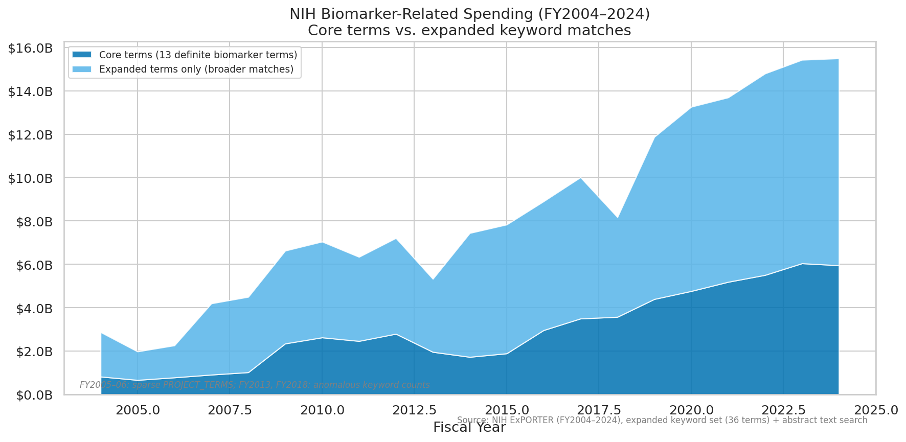
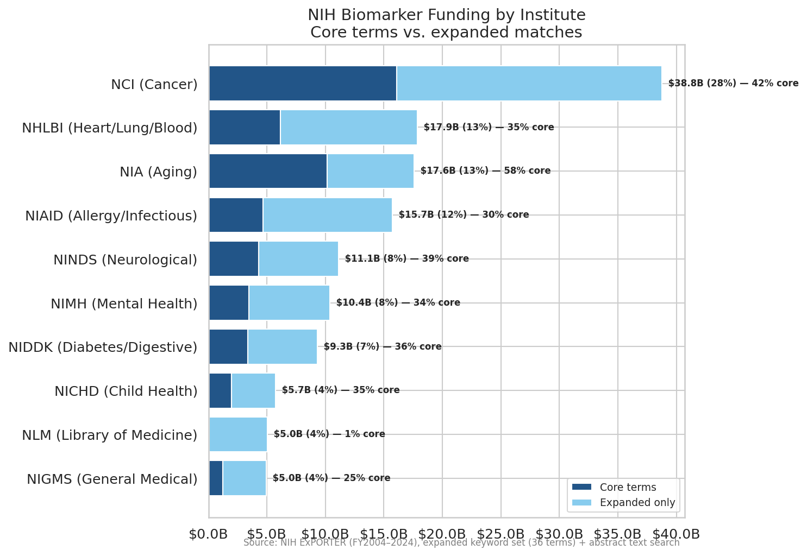
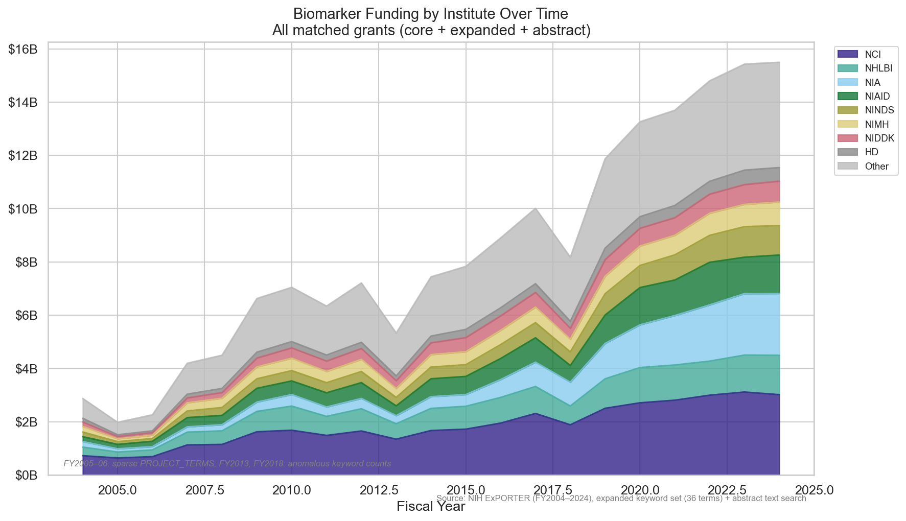

# Biomarker Screening: Dataset Characterization

## What This Is

A keyword-filtered subset of all NIH-funded grants from FY2004–2024. This is a **screening
step**, not a classification — it identifies grants that *mention* biomarker-related concepts
in their title or project terms, without judging how they use those concepts.

### Methodology

**Core terms (4):** biomarker, clinical marker, surrogate endpoint, imaging marker
**Expanded terms (+6):** digital biomarker, intermediate outcome, endophenotype, genetic marker,
clinical+omics, clinical+imaging

Grants matching core terms are flagged `EXPLICIT_BIOMARKER=TRUE`. All others matched via
expanded terms only. Matching is case-insensitive against PROJECT_TITLE and PROJECT_TERMS
fields in NIH ExPORTER data.

### Data Quality Caveats

- **FY2005**: PROJECT_TERMS field only 68% populated → undercounts expanded-term matches
- **FY2006**: PROJECT_TERMS field completely empty → severe undercount
- These years are annotated on all time-series charts

## Key Numbers

| Metric | Value |
|--------|-------|
| Total grants | 269,630 |
| Total funding | $134.49B |
| Explicit biomarker grants | 75,849 (28.1%) |
| Explicit biomarker funding | $35.77B (26.6%) |
| Year range | FY2004–2024 |

## Findings

### 1. Biomarker Spending Grew Nearly 8× in Two Decades

Biomarker-related NIH funding grew from $1.7B (FY2004) to $13.6B (FY2024). The growth
is roughly consistent across years, with dips at FY2005–06 (data quality) and FY2013
(sequester year).

### 2. NCI Dominates — Cancer Drove Early Biomarker Adoption

The National Cancer Institute leads with $28.2B across 66,450 grants — 21% of all
biomarker-related funding. NIA ($14.5B) and NHLBI ($13.1B) follow. Cancer research's
outsized share reflects oncology's early and deep adoption of biomarker-driven trial
design and companion diagnostics.

### 3. Institute Funding Composition Shifted Over Time

NCI has led throughout, but NIA and NHLBI grew substantially after 2010, reflecting
the expansion of biomarker concepts into aging (Alzheimer's fluid biomarkers) and
cardiovascular research. NIAID surges are visible around pandemic years.

## Planned: Funding by Biomarker Term

*Pending merge with parallel branch that adds `MATCH_SOURCE` column and per-keyword
filtered CSVs.* This will enable a fourth chart showing the fraction of funding
attributable to each keyword — particularly "biomarker" vs "surrogate endpoint" vs
"clinical marker" — which is the key sensitivity analysis for this screening step.

## What This Cannot Tell Us

This keyword screen captures grants that *mention* biomarkers, not grants that *study*
biomarkers rigorously. It cannot distinguish:

- A grant developing a validated surrogate endpoint from one that mentions "biomarker" in passing
- Causal/mechanistic biomarker work from correlational/discovery work
- Grants with a clear estimand from those without

That's the job of the LLM grading pipeline (Phase 2).
