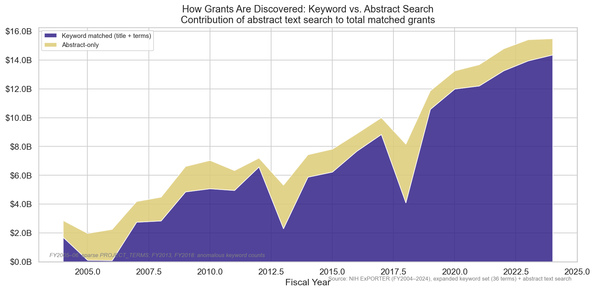
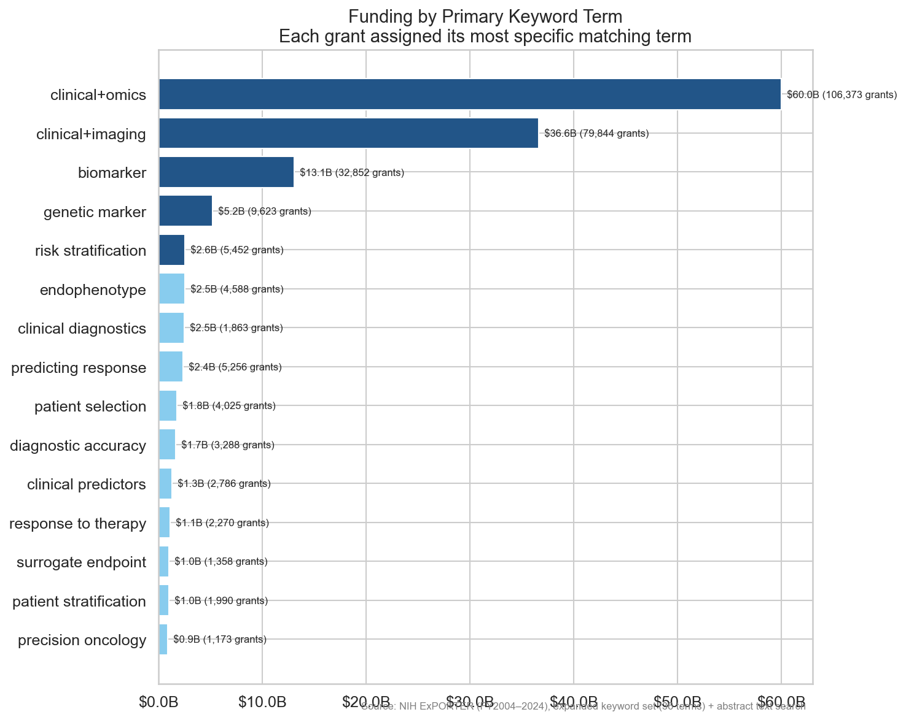

# Biomarker Screening: Dataset Characterization

## What This Is

A keyword-filtered subset of all NIH-funded grants from FY2004–2024. This is a **screening
step**, not a classification — it identifies grants that *mention* biomarker-related concepts
in their title, project terms, or abstract, without judging how they use those concepts.

### Methodology

**Core terms (13):** biomarker, clinical marker, surrogate endpoint, imaging marker,
endophenotype, intermediate outcome, intermediate endpoint, digital endpoint,
risk stratification, patient selection, companion diagnostic, predicting response,
response to therapy

**Expanded terms (+23):** digital biomarker, genetic marker, clinical+omics, clinical+imaging,
diagnostic accuracy/sensitivity/specificity, clinical diagnostics, personalized diagnostics,
clinical predictors, prognostic value, prognostic assays, clinically actionable,
patient/disease stratification, disease heterogeneity, clinical subtypes,
theranostics, precision oncology, predictive/genomic/proteomic signature, biosignature

**Matching sources:**
- **Keyword match**: PROJECT_TITLE and PROJECT_TERMS fields
- **Abstract match**: ABSTRACT_TEXT (catches grants that mention biomarker concepts only in the abstract)

**Facility screening:** Infrastructure sub-projects (Administrative Core, Shared Resource,
etc.) are excluded by title pattern. Center grants themselves (P30, P50) are preserved.

Grants matching core terms are flagged `EXPLICIT_BIOMARKER=TRUE`. All others matched via
expanded terms or abstract text only. Matching is case-insensitive.

### Data Quality Caveats

- **FY2005**: PROJECT_TERMS field only 68% populated — undercounts expanded-term matches
- **FY2006**: PROJECT_TERMS field completely empty — severe undercount
- **FY2013, FY2018**: Anomalous keyword counts — partially compensated by abstract search
- These years are annotated on all time-series charts

## Key Numbers

| Metric | Value |
|--------|-------|
| Total grants | 344,550 |
| Total funding | $175.22B |
| Explicit biomarker grants (core terms) | 127,394 (37.0%) |
| Explicit biomarker funding | $61.84B (35.3%) |
| Expanded-only grants | 217,156 (63.0%) |
| Expanded-only funding | $113.38B (64.7%) |
| Keyword-matched grants | 276,161 (80.2%) |
| Abstract-only grants | 68,389 (19.8%) |
| Year range | FY2004–2024 |
| Core terms | 13 |
| Expanded terms | 36 (includes all 13 core) |

## Findings

### 1. Biomarker Spending: Core vs. Expanded

Total biomarker-related funding grew from $2.9B (FY2004) to $15.5B (FY2024). The stacked
chart separates **core term matches** (definite biomarker work — $61.8B total) from
**expanded-only matches** (broader keyword proximity — $113.4B total). Core term funding
grew roughly proportionally, maintaining ~35% of the total throughout.

### 2. Institute Allocation: Who Funds Biomarker Research?

NCI leads with $38.8B across 84K grants — 22% of all biomarker-related funding. The
stacked bars reveal that **core term concentration varies widely**: NCI is 42% core,
while NLM is only 1% core (its grants mention biomarkers in expanded/abstract context).
NICHD (35% core) and NIDDK (36% core) are near the dataset average.

### 3. Institute Funding Over Time

NCI has led throughout, but NIA and NHLBI grew substantially after 2010, reflecting
the expansion of biomarker concepts into aging (Alzheimer's fluid biomarkers) and
cardiovascular research. NIAID surges are visible around pandemic years. This chart
shows all matched grants (core + expanded + abstract).

### 4. Explicit Biomarker Term Adoption

The fraction of matched grants using core biomarker terms hovers around 35–40%, with
dips at FY2005–06 (data quality) and FY2013 (sequester/data gap). This metric shows
that the majority of grants in our broad haystack don't use explicit biomarker
language — they mention biomarker-adjacent concepts captured by expanded terms.

### 5. How Grants Are Discovered: Keyword vs. Abstract Search

About 20% of matched grants (68K, $34.8B) were only discoverable through abstract
text search. This search method is critical for recovering grants from sparse years
(FY2005–06) and for capturing grants that discuss biomarker concepts in their
scientific narrative without using biomarker terms in title or project terms fields.

### 6. Funding by Grant Mechanism

Research grants (R01, R21, etc.) carry the majority of biomarker funding. Cooperative
agreements (U) are the second-largest mechanism, reflecting multi-site biomarker
validation studies. The mechanism breakdown shows core vs. expanded composition —
research grants have a higher core term rate than program/center grants.

### 7. Funding by Primary Keyword Term

Each grant is assigned its most specific matching term via priority ordering (most
specific wins). Among keyword-matched grants (276K of 344K), the AND-condition terms
`clinical+omics` ($60B, 106K grants) and `clinical+imaging` ($37B, 80K grants) dominate
because PROJECT_TERMS frequently contains both "clinical" and "omics" or "imaging"
substrings. These are the broadest expanded terms.

More targeted terms: `biomarker` ($13B, 33K grants), `genetic marker` ($5B, 10K),
`risk stratification` ($3B, 5K), `endophenotype` ($2.5B, 5K).

**Coverage:** 276K keyword-matched grants have PRIMARY_TERM (100%); 68K abstract-only
grants do not (they were matched via abstract text, not title/terms fields).

## What This Cannot Tell Us

This keyword screen captures grants that *mention* biomarkers, not grants that *study*
biomarkers rigorously. It cannot distinguish:

- A grant developing a validated surrogate endpoint from one that mentions "biomarker" in passing
- Causal/mechanistic biomarker work from correlational/discovery work
- Grants with a clear estimand from those without

That's the job of the LLM grading pipeline (Phase 2).
