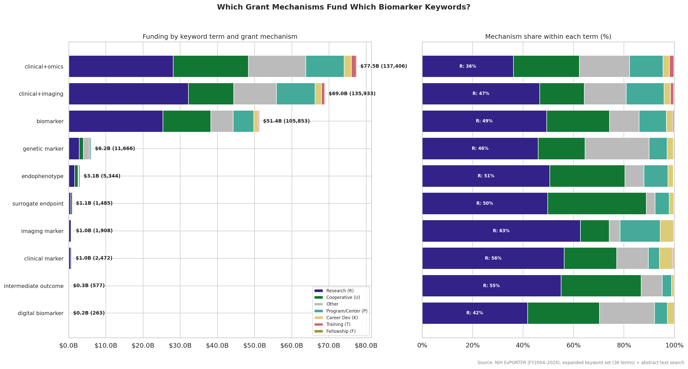

# NIH Biomarker Funding: Preliminary Keyword Analysis

## Purpose

This document characterizes 20 years of NIH-funded research that mentions
biomarker concepts, based on keyword screening of grant records from 2004 to
2024. It is a preliminary descriptive analysis — Phase 1 of a two-phase
pipeline. Phase 2 will use large language models to read each grant's abstract
and classify what kind of biomarker work was actually proposed, using a
structured rubric (`data/RUBRIC.md`) that evaluates intended biomarker use,
research design, and evidence strength for biomarker validity.

The keyword analysis here cannot tell us whether a grant that mentions
"biomarker" is doing rigorous surrogate endpoint validation or just using the
word in passing. That distinction is the purpose of Phase 2. What Phase 1 can
do is establish the overall scale of NIH biomarker funding, identify which
institutes and grant mechanisms are involved, and show how frequently specific
biomarker concepts appear across the funding landscape.

## Dataset

The dataset was constructed by searching all NIH grant records in the ExPORTER
database (fiscal years 2004–2024) for 36 biomarker-related keyword terms. Grants
were matched if any term appeared in the project title, structured keyword fields
(PROJECT_TERMS), or abstract text. Infrastructure sub-projects (administrative
cores, shared resources) were excluded by title pattern, but center grants
themselves (P30, P50) were preserved.

| Metric | Value |
|--------|-------|
| Dataset version | v3.1 |
| Total grants | 344,550 |
| Total funding | $175.2 billion |
| Year range | Fiscal years 2004–2024 |
| Keyword terms searched | 36 (13 core, 23 expanded) |
| Terms with at least one match | 35 of 36 |
| Grants matched via title or keyword fields | 276,161 (80%) |
| Grants matched via abstract text only | 68,389 (20%) |

The 13 **core terms** unambiguously indicate biomarker research: *biomarker*,
*clinical marker*, *surrogate endpoint*, *imaging marker*, *endophenotype*,
*intermediate outcome*, *intermediate endpoint*, *digital endpoint*,
*risk stratification*, *patient selection*, *companion diagnostic*,
*predicting response*, and *response to therapy*. The 23 **expanded terms** cast
a wider net, capturing grants that mention biomarker-adjacent concepts like
*diagnostic accuracy*, *precision oncology*, *genomic signature*, or
co-occurrence of "clinical" with "omics" or "imaging" terminology.

Grants matching any core term are flagged as definite biomarker research
(37% of grants, $61.8B). The remaining 63% matched only on expanded terms
or abstract text and may include false positives — grants that mention
biomarker concepts without actually studying biomarkers.

## Chart Registry

| ID | Title | Description | File |
|----|-------|-------------|------|
| C1 | Biomarker funding over time | Funding per fiscal year, split by core vs. expanded term matches | `spending_over_time.png` |
| C2 | Funding by NIH institute | Top 10 institutes by total biomarker funding, with core vs. expanded split | `institute_allocation.png` |
| C3 | Keyword terms by grant mechanism | Each keyword term's funding broken down by grant type (investigator-initiated, cooperative, center, etc.) | `term_by_mechanism.png` |

## Results

### C1: Biomarker Funding Over Time

Total NIH biomarker-related funding grew from approximately $3 billion in
FY2004 to $15 billion in FY2024. Core term matches (definite biomarker
research) consistently account for about one-third of the total, with the
remainder captured by broader expanded terms and abstract-text matches. The
growth is roughly proportional — core and expanded funding grew at similar
rates, suggesting the expansion reflects a general increase in biomarker-related
research rather than a shift toward or away from specific biomarker language.

### C2: Funding by NIH Institute

| Institute | Total funding | Grants | Core term rate |
|-----------|--------------|--------|----------------|
| NCI (Cancer) | $38.8B | 84,177 | 42% |
| NHLBI (Heart/Lung/Blood) | $17.9B | 31,751 | 35% |
| NIA (Aging) | $17.6B | 27,341 | 58% |
| NIAID (Allergy/Infectious) | $15.7B | 21,740 | 30% |
| NINDS (Neurological) | $11.1B | 23,066 | 39% |
| NIMH (Mental Health) | $10.4B | 21,558 | 34% |
| NIDDK (Diabetes/Digestive) | $9.29B | 22,232 | 36% |
| NICHD (Child Health) | $5.74B | 12,988 | 35% |
| NLM (Library of Medicine) | $5.02B | 1,023 | 1% |
| NIGMS (General Medical) | $4.96B | 12,989 | 25% |

### C3: Keyword Terms by Grant Mechanism

This chart shows every keyword term's funding broken down by NIH grant
mechanism. A single grant can match multiple terms (for example, a grant
mentioning both "biomarker" and "surrogate endpoint" appears in both rows), so
the rows are not mutually exclusive. The left panel shows absolute funding; the
right panel shows the percentage breakdown by mechanism within each term.

Grant mechanisms are grouped into broad categories: Research grants (R01, R21,
R03, etc.) are investigator-initiated basic and applied research. Cooperative
agreements (U) are multi-site collaborative studies. Program and center grants
(P) support institutional research infrastructure. Career development (K),
training (T), and fellowship (F) awards support individual researchers.

The two broadest keyword terms dominate: grants where "clinical" and "omics"
co-occur and grants where "clinical" and "imaging" co-occur. These AND-condition
terms cast the widest net and likely include many grants that are not primarily
about biomarkers. The generic term "biomarker" is next.

More specific terms are far smaller:

**Endpoint and surrogacy terms** — grants that explicitly name the concept of validating a biomarker as a stand-in for a clinical endpoint:

| Term | Total funding | Grants | Research grant share |
|------|--------------|--------|---------------------|
| Surrogate endpoint | $1.05B | 1,471 | 50% |
| Intermediate outcome | $0.26B | 569 | 53% |
| Intermediate endpoint | $0.12B | 197 | 34% |

**Clinical decision-making terms** — grants mentioning specific uses of biomarkers in patient care decisions:

| Term | Total funding | Grants | Research grant share |
|------|--------------|--------|---------------------|
| Response to therapy | $3.10B | 5,743 | 42% |
| Risk stratification | $3.10B | 6,457 | 60% |
| Predicting response | $2.79B | 6,016 | 55% |
| Patient selection | $2.05B | 4,526 | 52% |
| Companion diagnostic | $0.32B | 671 | 65% |

**Diagnostic and prognostic terms**:

| Term | Total funding | Grants | Research grant share |
|------|--------------|--------|---------------------|
| Clinical diagnostics | $2.81B | 2,418 | 23% |
| Diagnostic accuracy | $2.02B | 4,065 | 66% |
| Clinical predictors | $1.90B | 4,099 | 63% |
| Prognostic value | $1.05B | 2,672 | 76% |
| Clinically actionable | $0.87B | 1,601 | 49% |
| Personalized diagnostics | $0.46B | 754 | 50% |
| Diagnostic sensitivity | $0.29B | 652 | 79% |
| Diagnostic specificity | $0.27B | 634 | 69% |
| Prognostic assays | $0.22B | 539 | 71% |

**Stratification and precision medicine terms**:

| Term | Total funding | Grants | Research grant share |
|------|--------------|--------|---------------------|
| Patient stratification | $1.91B | 3,650 | 53% |
| Precision oncology | $1.12B | 1,670 | 19% |
| Disease heterogeneity | $1.00B | 1,570 | 38% |
| Theranostics | $0.62B | 1,511 | 64% |
| Clinical subtypes | $0.26B | 450 | 52% |
| Disease stratification | $0.13B | 203 | 32% |

**Discovery and identification terms**:

| Term | Total funding | Grants | Research grant share |
|------|--------------|--------|---------------------|
| Genetic marker | $6.15B | 11,525 | 46% |
| Endophenotype | $3.09B | 5,311 | 51% |
| Imaging marker | $1.04B | 1,845 | 63% |
| Clinical marker | $0.99B | 2,456 | 56% |
| Predictive signature | $0.71B | 1,299 | 45% |
| Genomic signature | $0.52B | 1,068 | 53% |
| Biosignature | $0.45B | 779 | 45% |
| Proteomic signature | $0.41B | 726 | 59% |
| Digital biomarker | $0.25B | 261 | 42% |

## Limitations

### What keyword screening cannot determine

This analysis identifies grants that *mention* biomarker concepts. It cannot
distinguish a grant that rigorously validates a surrogate endpoint from one
that uses the phrase "surrogate endpoint" once in a background paragraph.
It cannot assess whether a grant has a clear estimand, whether its research
design supports causal inference about biomarker validity, or whether its
findings would inform clinical decision-making.

These are the questions that Phase 2 addresses. The LLM grading pipeline reads
each grant's abstract and classifies it on three dimensions defined in
`data/RUBRIC.md`: intended biomarker use (17 categories from susceptibility/risk
through surrogate endpoint), research design (observational vs. experimental,
with subtypes), and evidence strength for biomarker validity (correlational
through causal-clinical). This rubric extends the FDA-NIH BEST framework to
capture the gradient of specificity in how researchers invoke biomarker concepts.

### Data quality

Four fiscal years have known data gaps in the PROJECT_TERMS structured keyword
field: FY2005 (68% populated), FY2006 (completely empty), FY2013 and FY2018
(anomalous keyword counts). Abstract text search partially compensates for
missing structured keywords in these years. These years are annotated on
time-series charts.

### Term coverage

1 of 36 keyword terms produced zero matches across the
entire dataset. These terms may not appear in NIH grant language, or they may be
expressed using different phrasing.

## Methodology

- **Term matching**: Case-insensitive substring matching against project title,
  structured keyword fields (PROJECT_TERMS), and abstract text. AND-condition
  terms (e.g., requiring both "clinical" and "omics" to be present) require
  both words to appear in the same text field.
- **Term priority**: Each grant is assigned a single primary term for
  non-overlapping counts, using a priority ordering where more specific terms
  (e.g., "surrogate endpoint") take precedence over broader terms (e.g.,
  "biomarker"). The term-by-mechanism chart (C3) uses all matched terms per
  grant instead, so a grant matching multiple terms appears in each term's row.
- **Facility screening**: Infrastructure sub-projects (administrative cores,
  shared resources, data cores, tissue procurement) are excluded by title
  pattern matching. Parent center grants (P30, P50) are preserved.
- **Data quality years**: 2005, 2006, 2013, 2018
