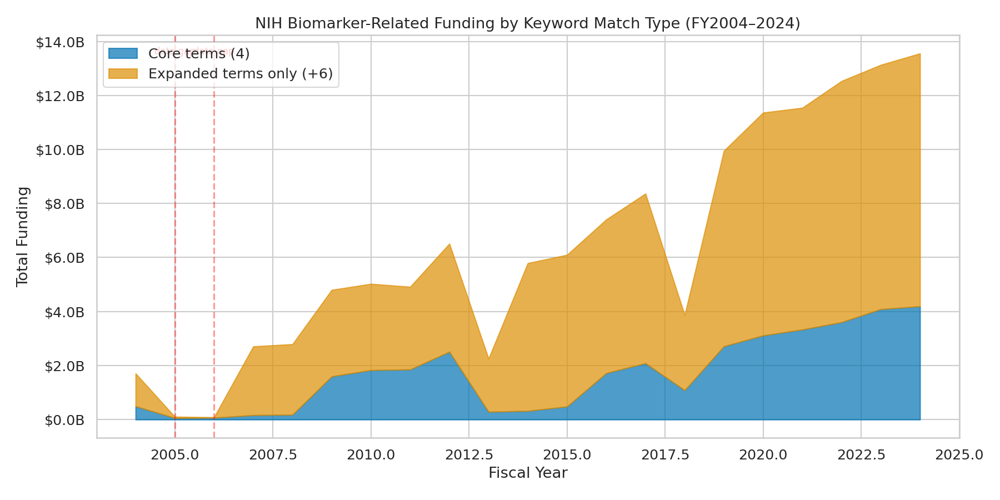
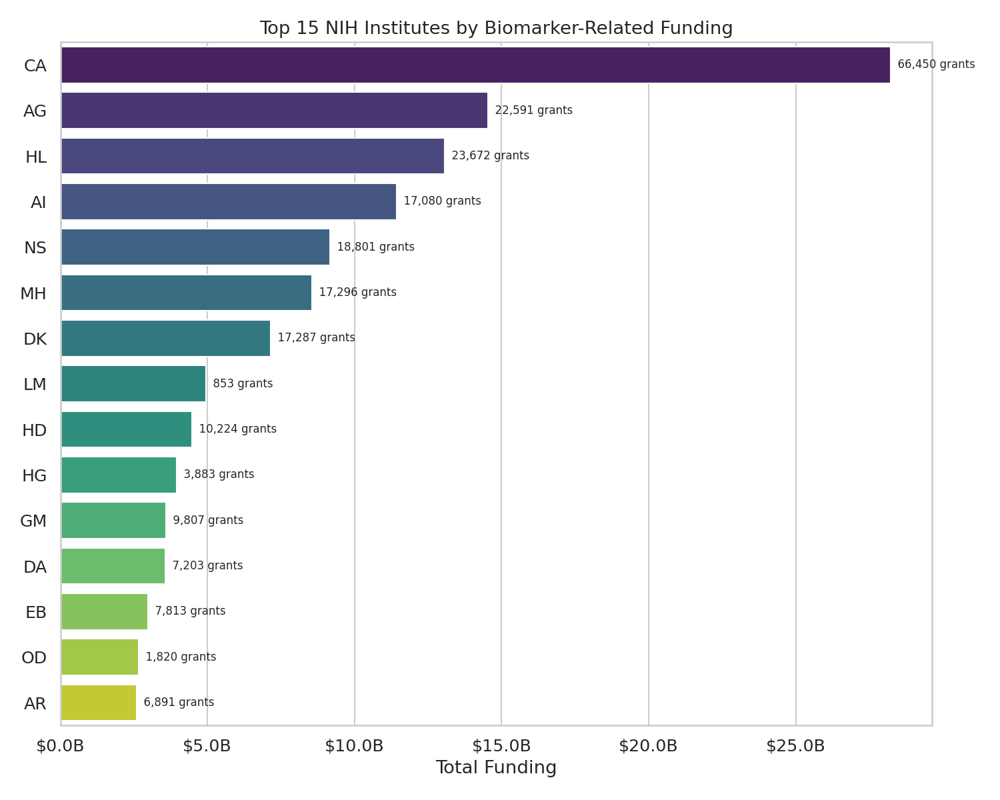
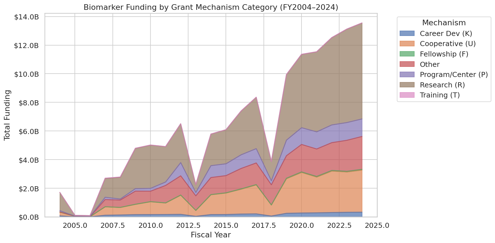
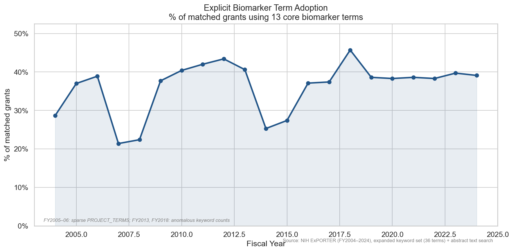

# Biomarker Screening: Dataset Characterization

## What This Is

A keyword-filtered subset of all NIH-funded grants from FY2004–2024. This is a **screening
step**, not a classification — it identifies grants that *mention* biomarker-related concepts
in their title or project terms, without judging how they use those concepts.

### Methodology

**Core terms (4):** biomarker, clinical marker, surrogate endpoint, imaging marker
**Expanded terms (+6):** digital biomarker, intermediate outcome, endophenotype, genetic marker,
clinical+omics, clinical+imaging

Grants matching core terms are flagged `EXPLICIT_BIOMARKER=TRUE`. All others matched via
expanded terms only. Matching is case-insensitive against PROJECT_TITLE and PROJECT_TERMS
fields in NIH ExPORTER data.

### Data Quality Caveats

- **FY2005**: PROJECT_TERMS field only 68% populated → undercounts expanded-term matches
- **FY2006**: PROJECT_TERMS field completely empty → severe undercount
- These years are annotated on all time-series charts

## Key Numbers

| Metric | Value |
|--------|-------|
| Total grants | 269,630 |
| Total funding | $134.49B |
| Explicit biomarker grants | 75,849 (28.1%) |
| Explicit biomarker funding | $35.77B (26.6%) |
| Year range | FY2004–2024 |

## Findings

### 1. Funding Has Grown ~8x in 20 Years

Biomarker-related NIH funding grew from $1.71B (FY2004) to $13.55B (FY2024) — a ~7.9x
increase. Both core-term and expanded-term matches show steady growth, with core-term
grants consistently representing roughly a quarter of the total.

### 2. NCI Dominates Biomarker Funding

The National Cancer Institute (NCI) leads with $28.2B across 66,450 grants — roughly 21%
of all biomarker-related funding. The National Institute on Aging ($14.5B) and NHLBI
($13.1B) follow. Cancer research's outsized share likely reflects oncology's early and
deep adoption of biomarker-driven trial design.

### 3. Research Grants (R-series) Are the Primary Mechanism

R-series grants (R01, R21, etc.) account for $63.0B across 135,643 grants — nearly half
of all biomarker funding. Cooperative agreements (U-series, $29.4B) are the second
largest category. The dominance of hypothesis-driven research grants over cooperative
agreements or contracts is notable — it suggests most biomarker funding flows to
discovery and basic research rather than the coordinated validation or clinical
qualification work that cooperative mechanisms tend to support.

### 4. Explicit Biomarker Terminology Adoption

The percentage of keyword-matched grants that use core biomarker terminology has
remained relatively stable at ~28%, suggesting the expanded terms capture a consistent
proportion of biomarker-adjacent work that doesn't self-identify with the "biomarker"
label.

## What This Cannot Tell Us

This keyword screen captures grants that *mention* biomarkers, not grants that *study*
biomarkers rigorously. It cannot distinguish:

- A grant developing a validated surrogate endpoint from one that mentions "biomarker" in passing
- Causal/mechanistic biomarker work from correlational/discovery work
- Grants with a clear estimand from those without

That's the job of the LLM grading pipeline (Phase 2).
